# Happy Birthday, Baby — your captions and five alternatives

Listed in gallery order. Your supplied drafts are used on the post; the alternatives below are for later selection. Spelling and grammar are lightly corrected in the alternatives.

## 01. DSCF6808.jpeg

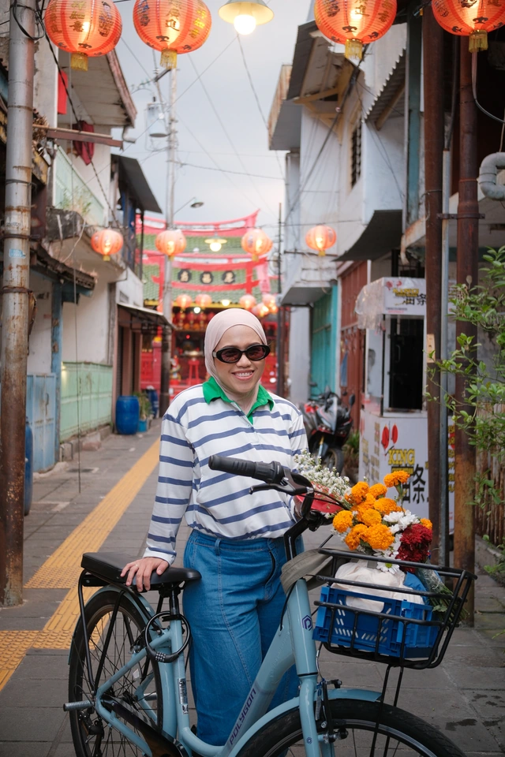

Your draft: Bolekah ku menyimpan rasa?

1. Bolehkah ku menyimpan rasa?
2. Bolehkah rasa ini kusimpan lebih lama?
3. Masih menyimpan rasa yang sama.
4. Bolehkah aku terus jatuh cinta?
5. Kalau untukmu, rasanya masih sama.

## 02. IMG_7325.HEIC

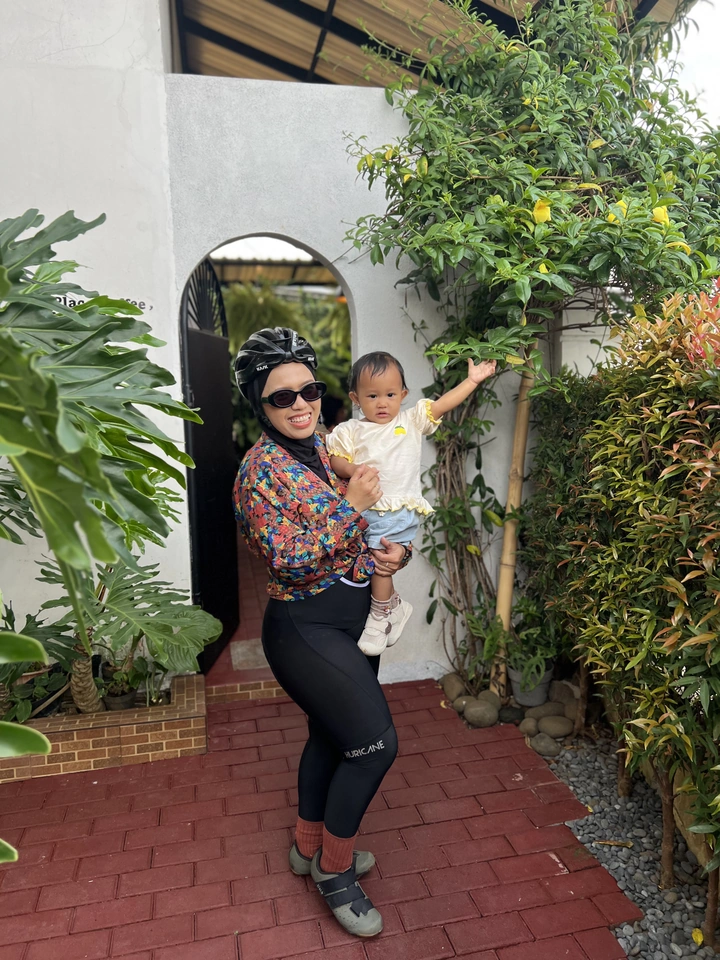

Your draft: A short morning ride to nearby cafe

1. A short morning ride to a nearby café.
2. A little morning ride, with coffee at the end.
3. Taking the scenic route to our morning coffee.
4. A nearby café was all the excuse we needed.
5. A small ride to start the day together.

## 03. IMG_5515.HEIC

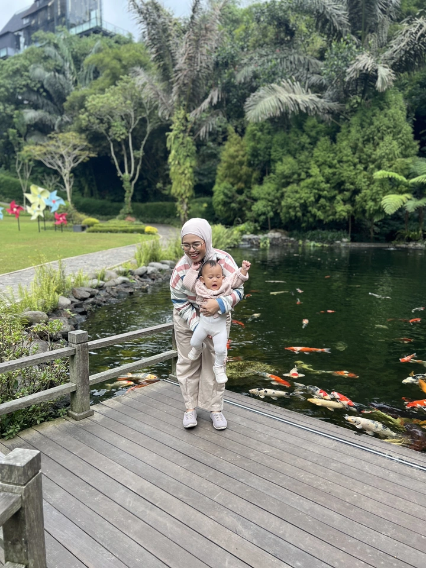

Your draft: Let me down!

1. Mama, let me down!
2. Lovely pond. Now please put me down.
3. I have things to investigate down there.
4. The photo can wait. Let me down!
5. Mama has a photo planned. Kinanti has other plans.

## 04. DSCF4149.JPG

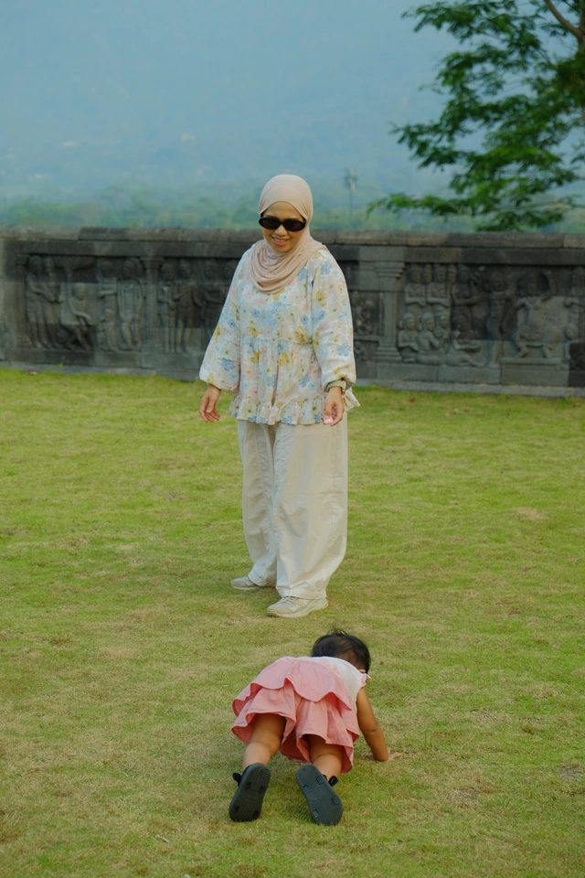

Your draft: Terpesona... Aku terpesona...

1. Terpesona… aku terpesona…
2. Mama terpesona. Kinanti sibuk sendiri.
3. Terpesona sama Mama, bukan rumputnya.
4. Yang satu berpose, yang satu menjelajah.
5. Aku terpesona. Kinanti belum selesai urusan rumputnya.

## 05. DSCF2059.JPG

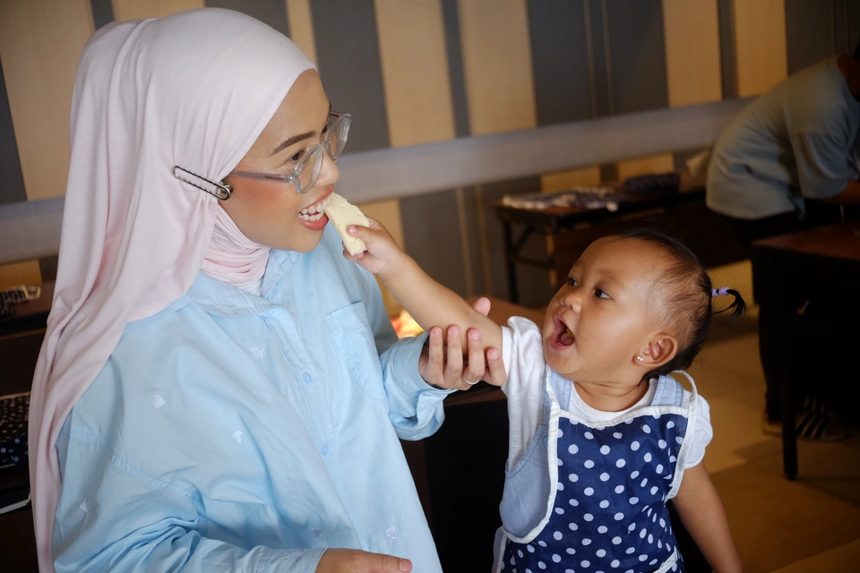

Your draft: Chef Kinanti in action

1. Chef Kinanti at work.
2. Chef Kinanti makes sure Mama gets a bite.
3. Today’s special, personally served by Kinanti.
4. A little taste from Chef Kinanti.
5. The chef insists Mama try this.

## 06. IMG_7341.HEIC

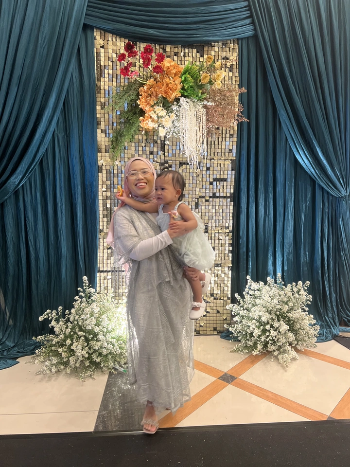

Your draft: Let me down! (part 2)

1. Let me down! The sequel.
2. Mama, we’ve discussed this. Let me down.
3. Still requesting permission to explore.
4. Another photo, another request to be put down.
5. Let me down, please. Again.

## 07. IMG_5249.HEIC

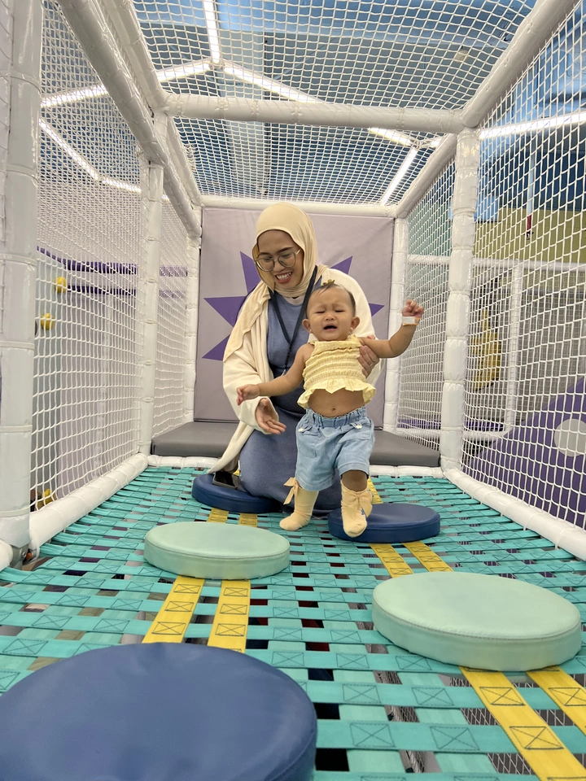

Your draft: Let me go!

1. Mama, let me go!
2. I can take it from here, Mama.
3. Kinanti would like to explore independently.
4. There’s a playground to inspect. Let me go!
5. A small explorer requesting a little freedom.

## 08. DSCF3137.JPG

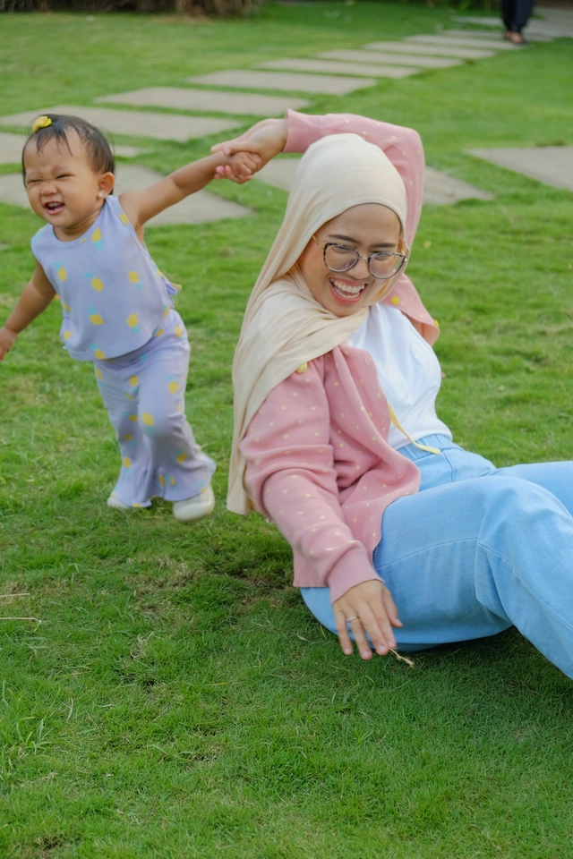

Your draft: Let me go! (part 2)

1. Let me go! The sequel.
2. Still very keen to do this herself.
3. Mama laughs. Kinanti negotiates her freedom.
4. The request for independence continues.
5. Same request, slightly more dramatic delivery.

## 09. DSCF2932.JPG

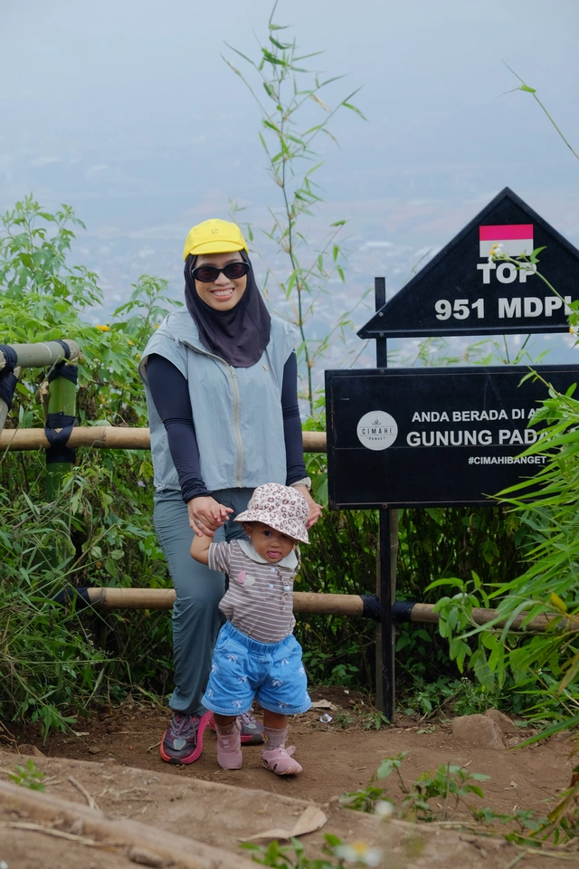

Your draft: A short hike to Padakasih

1. A little hike up Padakasih.
2. Small steps on the way up Padakasih.
3. A short hike with our smallest hiking companion.
4. Up Padakasih with Mama’s hands to hold.
5. A little family adventure on Padakasih.

## 10. IMG_7265.HEIC

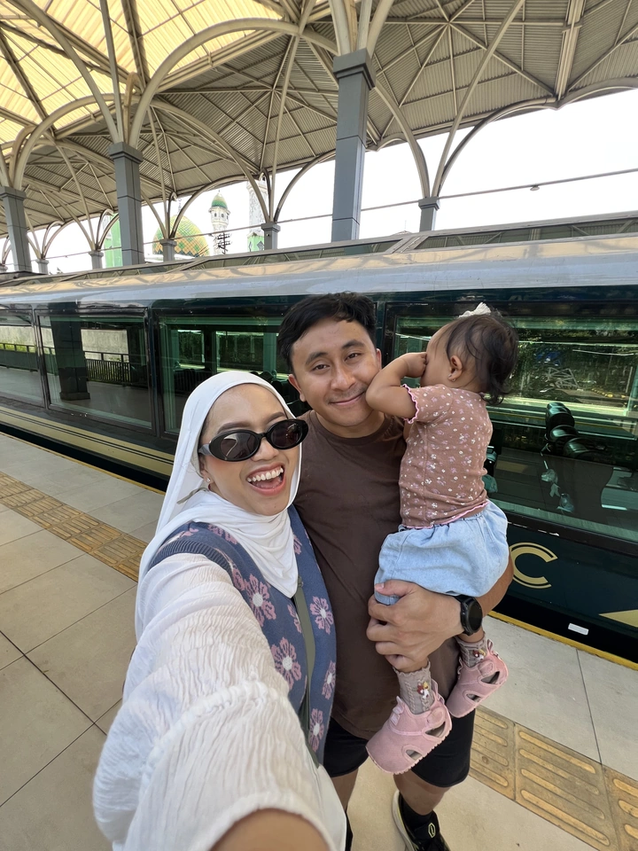

Your draft: First taking a panoramic train to Garut

1. Our first panoramic train ride to Garut.
2. Off to Garut on the panoramic train.
3. A first panoramic train trip for our little family.
4. Taking the panoramic route to Garut.
5. Garut-bound, with a view along the way.

## 11. IMG_7154.HEIC

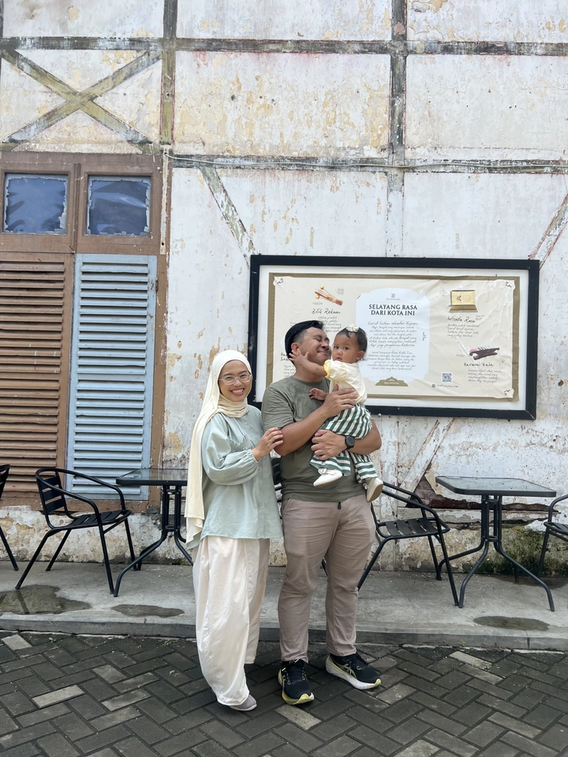

Your draft: Just arrived at Garut

1. Just arrived in Garut.
2. Hello, Garut. The three of us have arrived.
3. First stop: a family photo in Garut.
4. Made it to Garut with my favorite people.
5. A little arrival photo before exploring Garut.

## 12. IMG_4673.heic

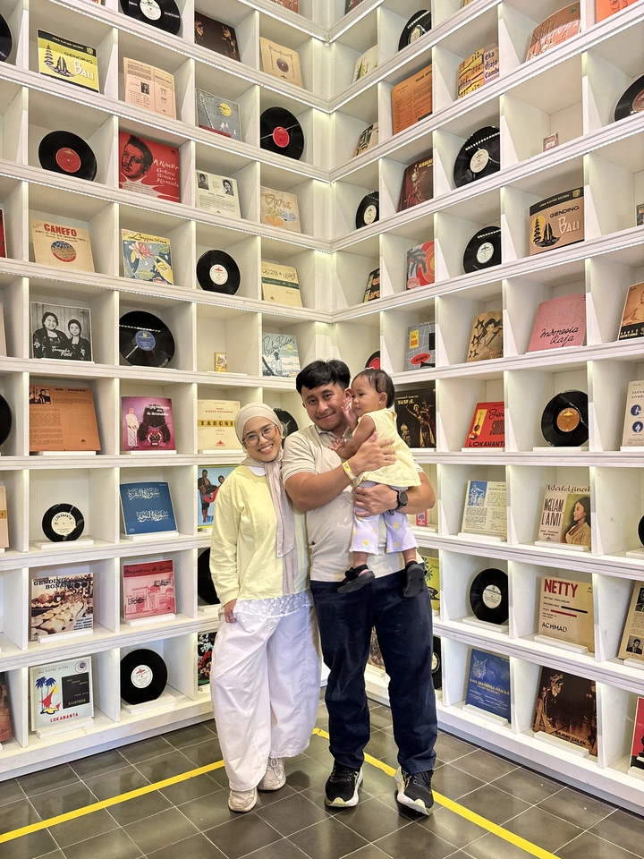

Your draft: Record collections at Lokananta

1. Browsing the record collection at Lokananta.
2. A little music history at Lokananta.
3. Family photo, with Lokananta’s record collection behind us.
4. Stopping by Lokananta to look through the records.
5. Records for us. Plenty to look at for Kinanti.

## 13. DSCF6645.jpeg

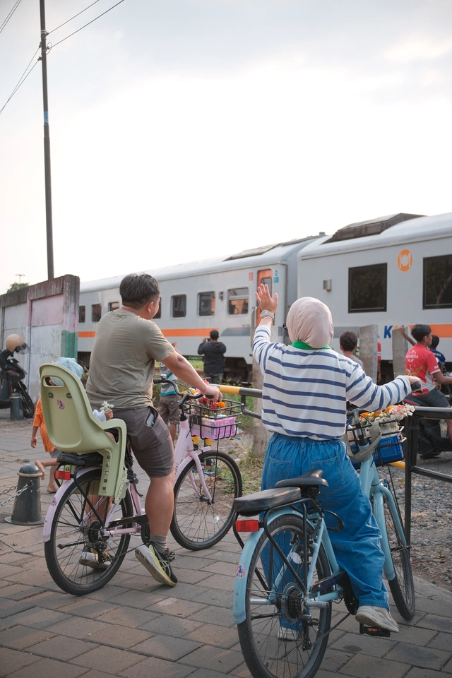

Your draft: Kinanti's favorite activity: waving at a passing train

1. Kinanti’s favorite pastime: waving at passing trains.
2. A passing train deserves a proper wave.
3. We stopped the bikes for a very important train wave.
4. Train coming. Waving duties begin.
5. One of Kinanti’s favorite reasons to stop along the way.

## 14. IMG_9157.HEIC

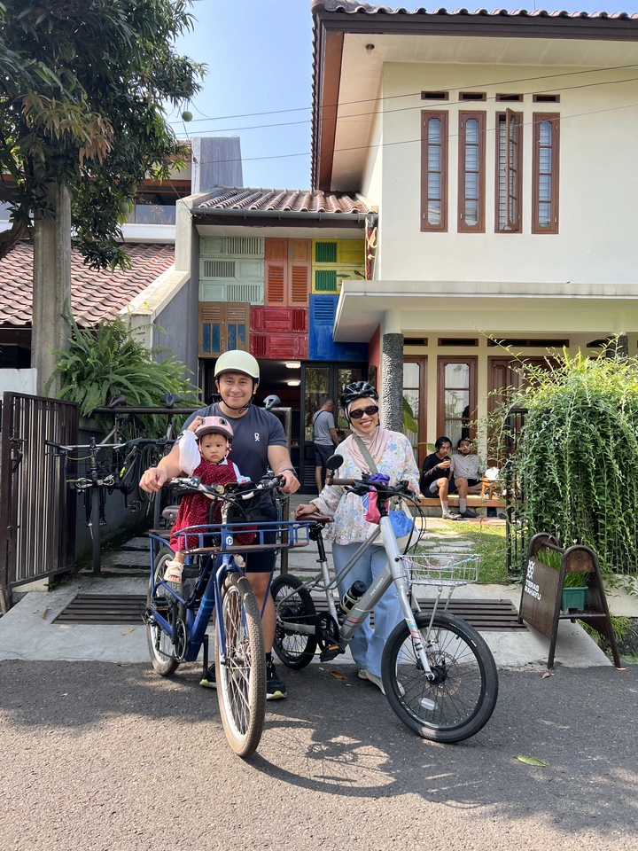

Your draft: A short ride hunting for breakfast

1. A little bike ride in search of breakfast.
2. Breakfast hunting with our little family.
3. Taking the bikes out to find something to eat.
4. A short ride, with breakfast as the destination.
5. Three hungry people and a breakfast plan.

## 15. IMG_9107.HEIC

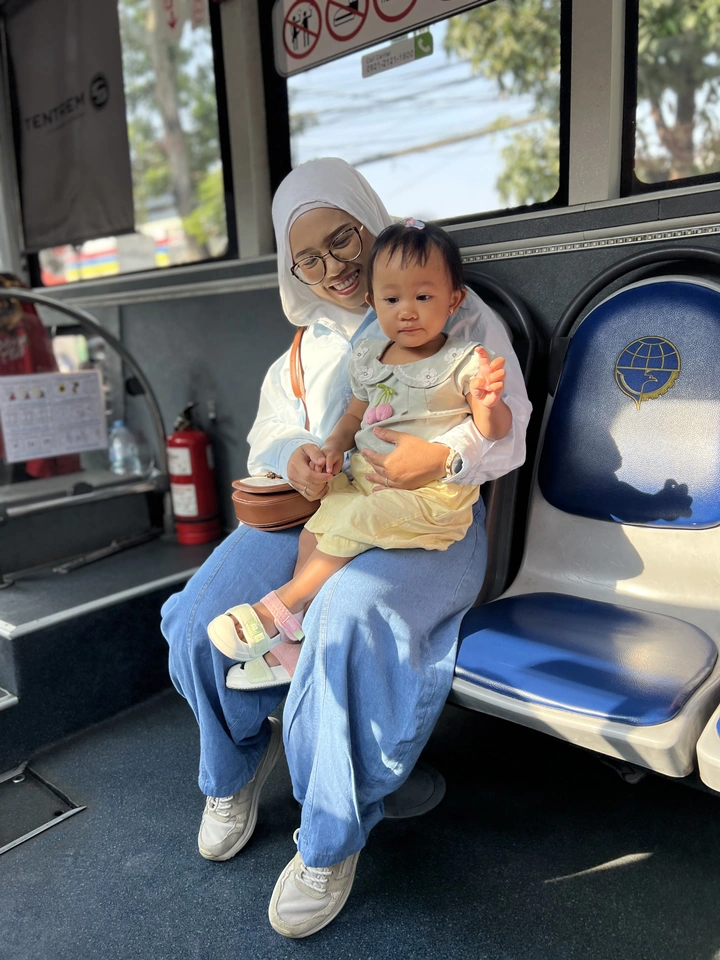

Your draft: A calm bus ride to Bandung

1. A quiet bus ride to Bandung.
2. Bandung-bound, enjoying a calm little moment.
3. A peaceful stretch of our bus ride to Bandung.
4. A calm bus ride. We’ll take it.
5. Heading to Bandung with a very good little seatmate.

## 16. IMG_6931.HEIC

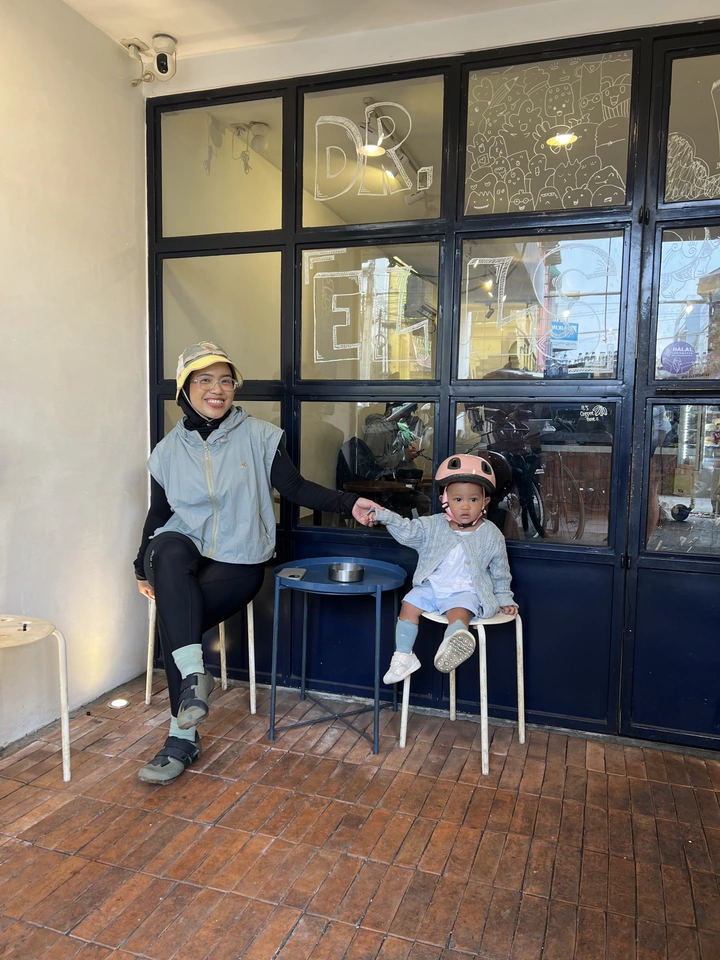

Your draft: A short stop for Kinanti to take a nap

1. A little stop for Kinanti’s nap.
2. The outing pauses for nap time.
3. A quick nap stop for our smallest traveler.
4. Kinanti needs a nap. The rest can wait.
5. Taking a little break on Kinanti’s schedule.

## 17. DSCF4340.JPG

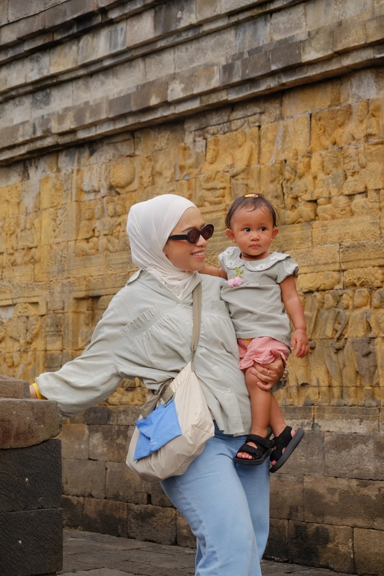

Your draft: An excurtion to Borobudur temple

1. An outing to Borobudur Temple.
2. A little family excursion to Borobudur.
3. Exploring Borobudur with our smallest companion.
4. Old stone, new family memories at Borobudur.
5. A day out together at Borobudur.

## 18. Main Terus_Kak Dwi-5.jpeg

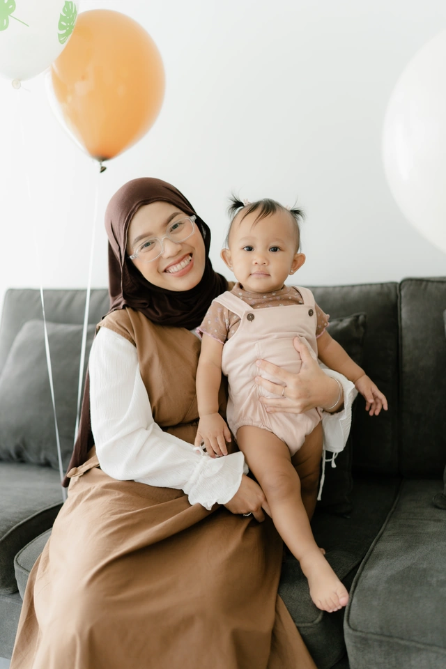

Your draft: A photoshot for Kinanti turned one

1. A photoshoot for Kinanti’s first birthday.
2. Kinanti turns one, and we take a few photos.
3. A first-birthday photo with Mama.
4. One year of Kinanti. Plenty to celebrate.
5. Marking Kinanti’s first birthday with a little photoshoot.

## 19. IMG_8354.HEIC

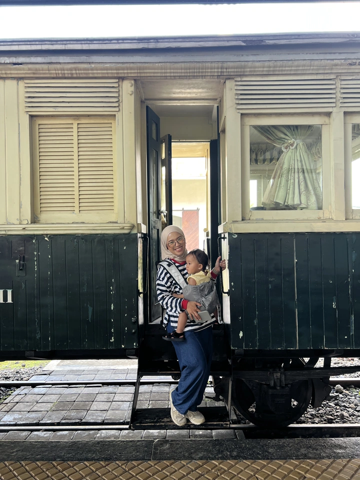

Your draft: A short train ride between Ambarawa and Tuntang

1. A short train ride from Ambarawa to Tuntang.
2. A little railway outing between Ambarawa and Tuntang.
3. All aboard for a short ride to Tuntang.
4. A small train adventure from Ambarawa.
5. Enjoying the short ride between Ambarawa and Tuntang.

## 20. IMG_7387.HEIC

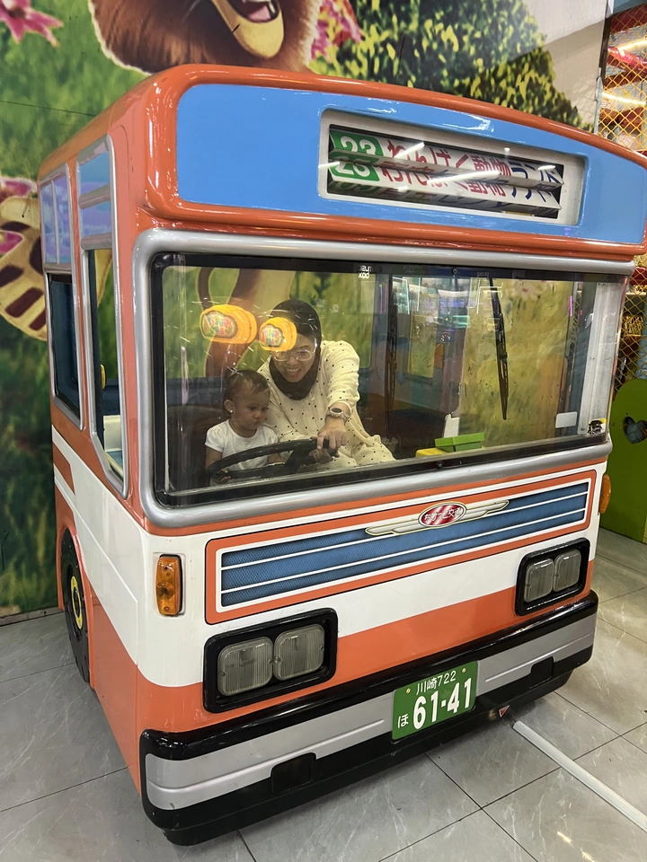

Your draft: Kinanti as a bus driver

1. Kinanti takes the driver’s seat.
2. Our bus driver is a little smaller than expected.
3. Driver Kinanti, ready for departure.
4. Kinanti has taken over the transport arrangements.
5. Next stop, according to Kinanti.

## 21. IMG_8650.HEIC

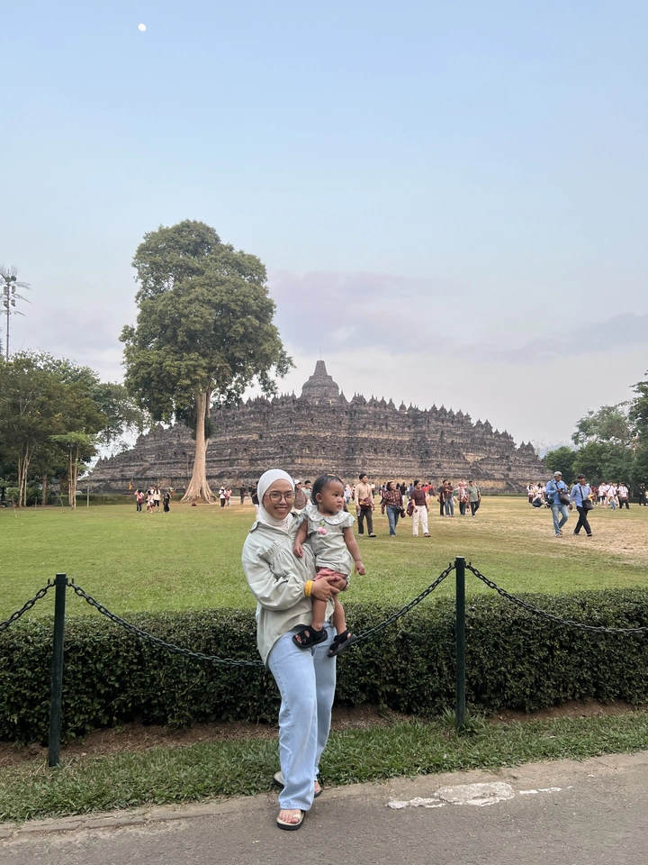

Your draft: Hungry and tired after an evening excurstion in Borobudur

1. Hungry and tired after an evening at Borobudur.
2. An evening at Borobudur, followed by a very necessary meal.
3. Borobudur was lovely. Now we need food and a rest.
4. After Borobudur: hungry people, tired feet.
5. A good evening out, with hungry and tired at the end.

## 22. IMG_9443.HEIC

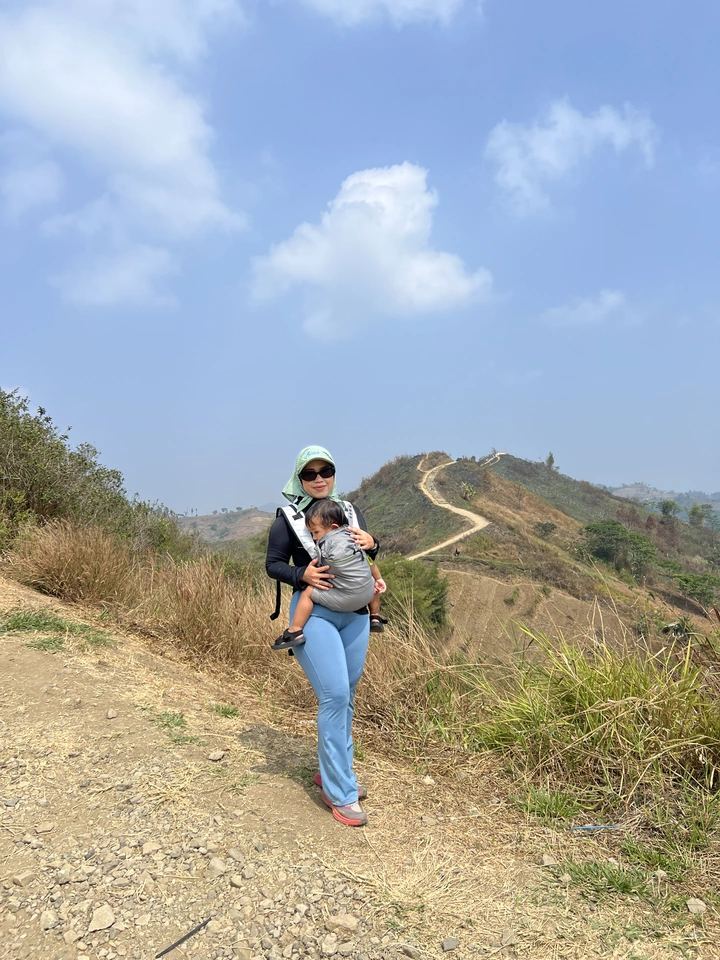

Your draft: A barren hiking route at Bumi Hejo

1. A bare hillside on our hike at Bumi Hejo.
2. Not much shade on this stretch of Bumi Hejo.
3. A hike through the open hills of Bumi Hejo.
4. Bumi Hejo, with plenty of sky overhead.
5. An exposed stretch of trail at Bumi Hejo.

## 23. IMG_9023.HEIC

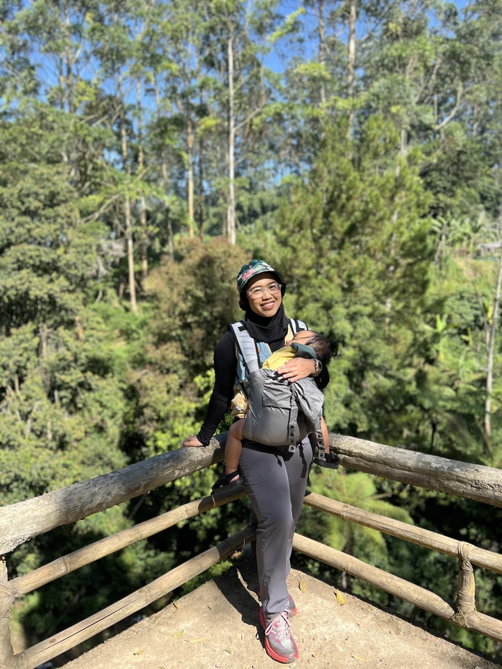

Your draft: A hike to waterfall

1. A little hike to a waterfall.
2. Walking through the trees on the way to a waterfall.
3. A waterfall hike, with a sleeping companion.
4. Off to find a waterfall together.
5. A trail, a waterfall, and a little nap along the way.

## 24. IMG_4951.HEIC

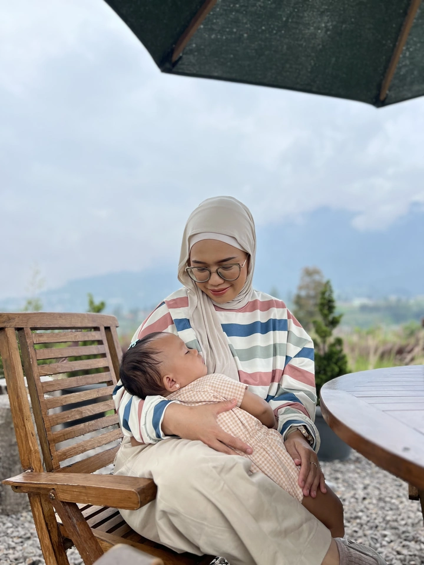

Your draft: Kinanti's sleeping with Burangrang at the distance

1. Kinanti asleep, with Burangrang in the distance.
2. Burangrang gets the view. Kinanti gets a nap.
3. A little nap with Burangrang beyond us.
4. Sleeping through the view of Burangrang.
5. Nap time, with Burangrang in the background.

## 25. DSCF3930.JPG

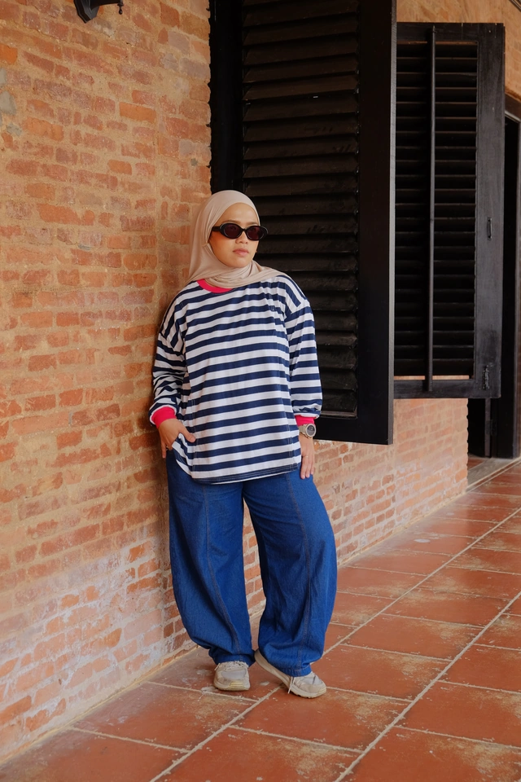

Your draft: Posing at Forth Williem

1. A little photo stop at Fort Willem.
2. Posing at Fort Willem.
3. One more photo before leaving Fort Willem.
4. A quiet moment by the wall at Fort Willem.
5. A stop at Fort Willem, with my favorite person in frame.

## 26. DSCF4646.JPG

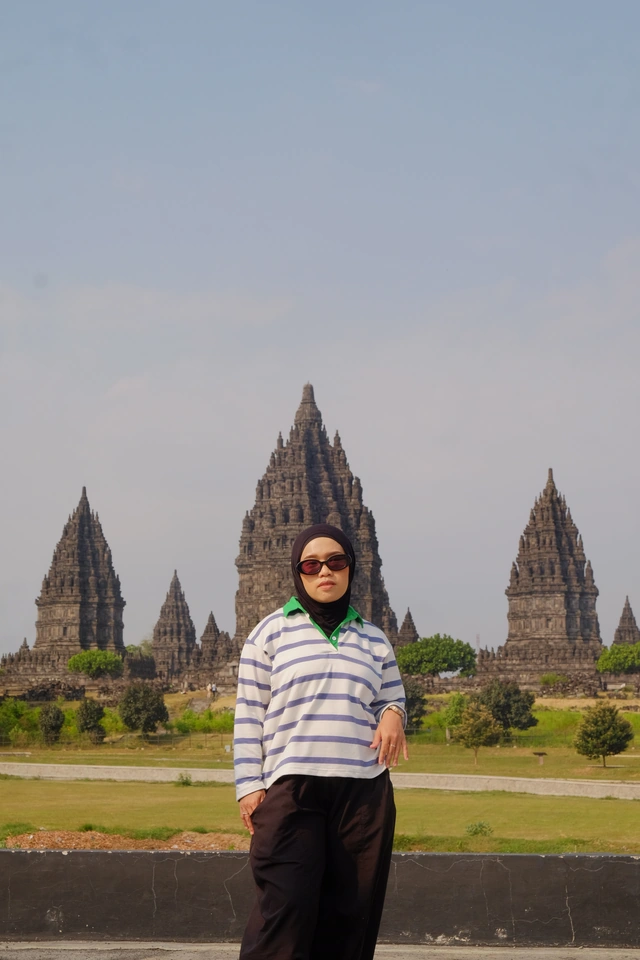

Your draft: A quick lunch stop at Candi Prambanan

1. A quick lunch stop at Prambanan.
2. Prambanan, with a lunch break along the way.
3. A little lunch stop during our Prambanan visit.
4. Temple exploring makes a good case for lunch.
5. Pausing for lunch at Prambanan.

## 27. DSCF4707.JPG

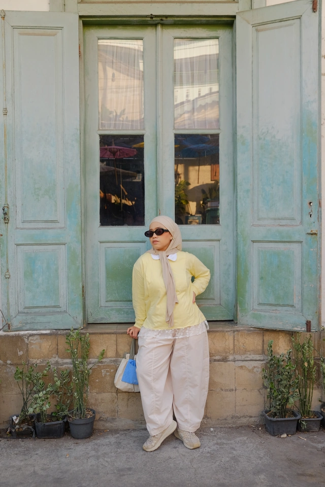

Your draft: Exploring Kampung Batik Kauman

1. A little wander through Kampung Batik Kauman.
2. Exploring the corners of Kampung Batik Kauman.
3. A photo stop while wandering around Kauman.
4. Taking our time in Kampung Batik Kauman.
5. Another little detour through Kampung Batik Kauman.

## 28. DSCF6671.jpeg

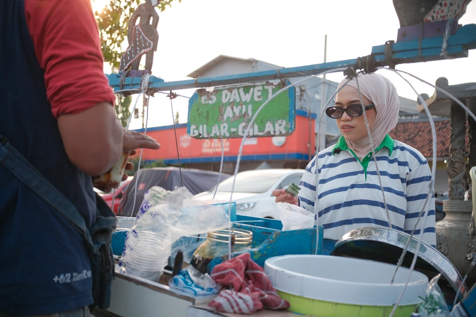

Your draft: Es Dawet for scorching Semarang's heat

1. Es dawet for the Semarang heat.
2. A cold es dawet on a very hot Semarang day.
3. Semarang was hot. Es dawet was necessary.
4. A very sensible es dawet stop in Semarang.
5. Cooling down with es dawet in Semarang.

## 29. DSCF6769.jpeg

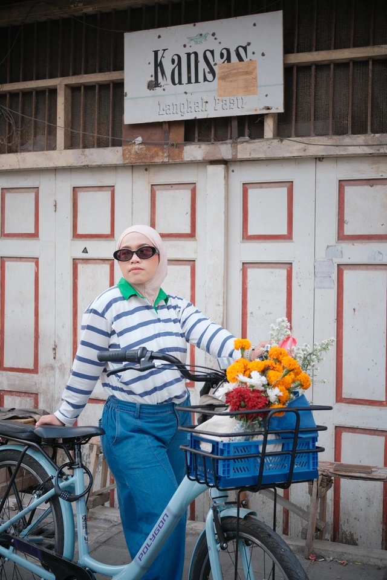

Your draft: A short bike tour in Semarang China town

1. A little bike tour through Semarang’s Chinatown.
2. Exploring Semarang’s Chinatown on two wheels.
3. A short ride through the lanes of Semarang’s Chinatown.
4. Bikes and flowers in Semarang’s Chinatown.
5. A little Chinatown outing, with the bikes along for company.

## 30. IMG_8771.HEIC

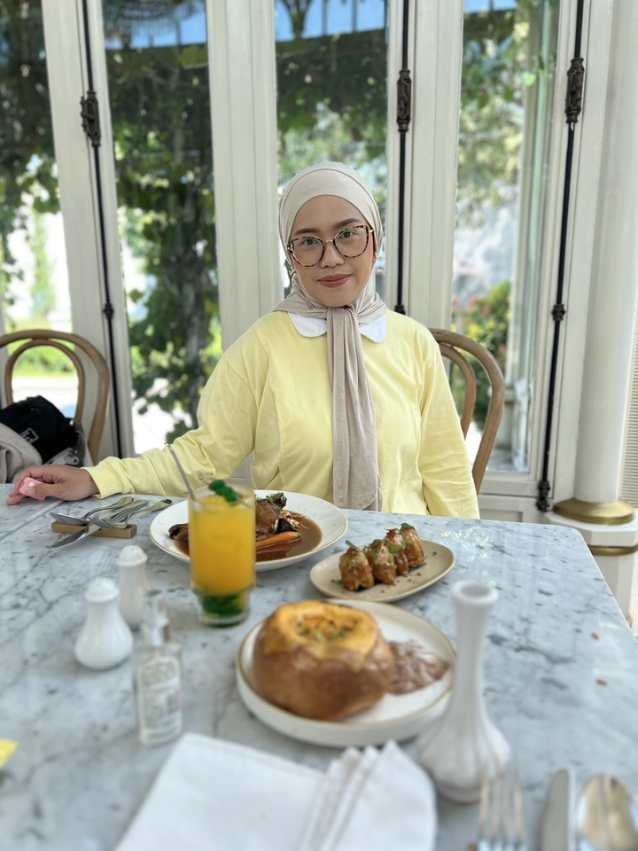

Your draft: Lunch at Pracimasana

1. A lunch stop at Pracimasana.
2. Lunch together at Pracimasana.
3. Pracimasana, and a very welcome lunch break.
4. Taking a little time over lunch at Pracimasana.
5. A table for lunch at Pracimasana.

## 31. IMG_6758.HEIC

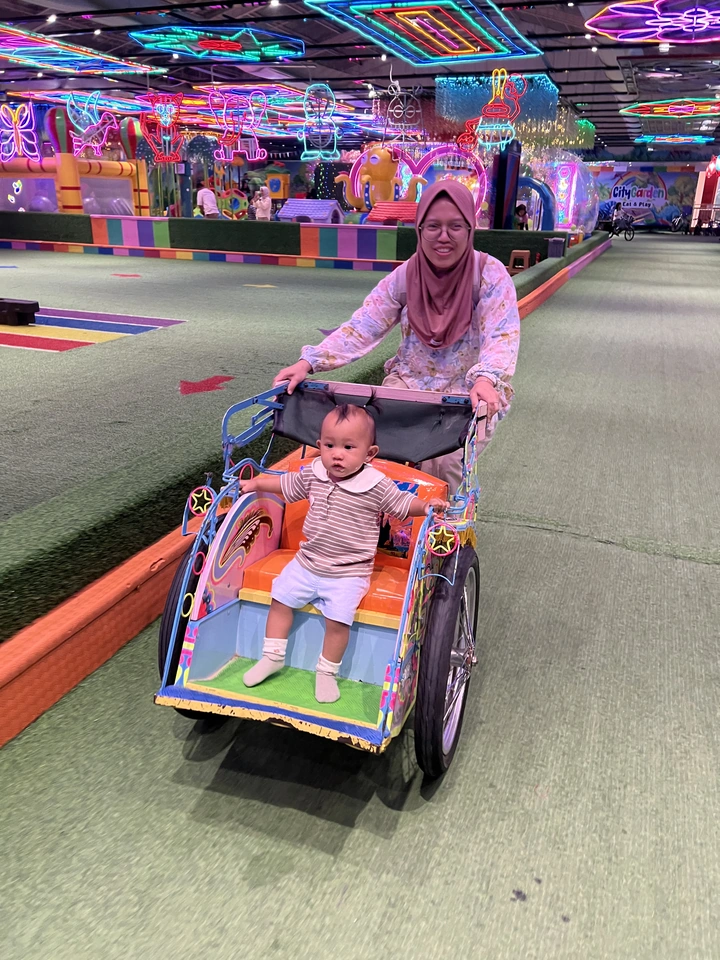

Your draft: Jika aku menjadi

1. Jika aku menjadi…
2. Jika aku menjadi teman jalanmu selamanya.
3. Jika aku menjadi orang yang selalu ikut rencanamu.
4. Jika aku menjadi tempatmu berbagi cerita.
5. Jika aku menjadi bagian dari hari-harimu.

## 32. IMG_9654.HEIC

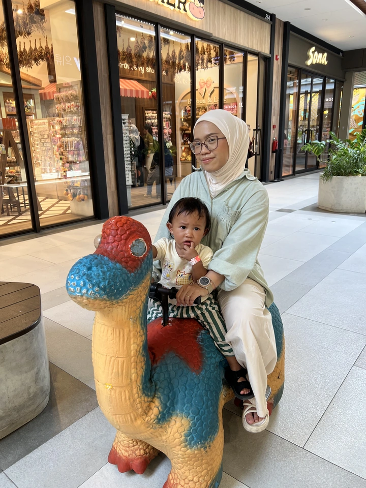

Your draft: One requirement as a parent: able to tame a Dinosaurus

1. One parenting requirement: being able to tame a dinosaur.
2. Parenting now includes dinosaur management.
3. Mama has the dinosaur situation under control.
4. Apparently, raising a child also involves taming dinosaurs.
5. Another useful parenting skill: handling the occasional dinosaur.
